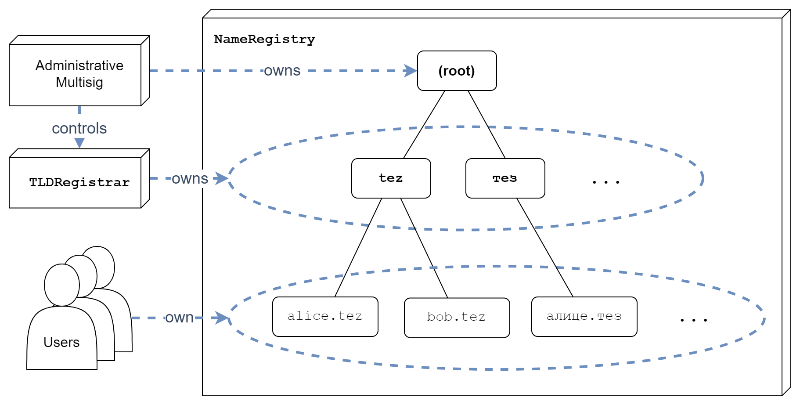

# Ownership Scheme

The ownership scheme in the name registry is as follows (from top to bottom):
1. The **root** of all domains is owned by the administrative multisig.
2. **Top-level domains** are created by the administrative multisig and then transferred to the TLD registrar contract.
3. **Second-level domains** are in turn created by the TLD registrar on behalf of buying users and transferred to them upon creation. The users are then responsible for their management.
4. **Third-and-higher-level domain** creation and management is completely in the hands of the users.

## Administrative Multisig
This is a formally verified multisig contract with keys held by well known community members. It's needed for administrative actions like:
* creating new top-level domains,
* updating the [TLD configuration](top-level-domain-registrar#configuration),
* deploying new versions of contracts if a critical vulnerability is found.
