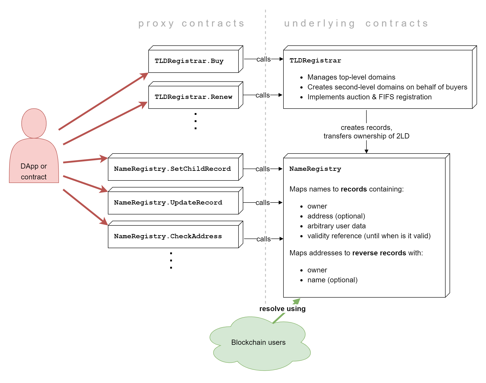

# Smart Contract Overview

## Architecture & Upgradeability

Tezos Domains smart contracts are designed to be upgradeable on multiple levels:

* **bugfixes** can be deployed in the future by changing the implementation of existing code,
* **new features** can be introduced by adding new code,
* **storage structure** can be theoretically also extended \(although this would be considered a major change that would require data migration\).

Upgradeability is achieved by having:

* a set of implementation or **underlying** **contracts** that contain both storage and mutable code in the form of Michelson lambdas,
* a set of **proxy contracts** that act as an outward interface.

### Proxy Contracts

Proxy contracts provide a fixed interface that will always keep working under the same address and will be kept forward-compatible. A proxy contract can also be repointed to a new underlying contract in case of a major upgrade that requires the storage to be migrated.

To optimize for gas cost, we keep only one entrypoint per proxy contract. All proxy contracts are prefixed by the name of its underlying contract \(e.g. `NameRegistry.CheckAddress` is the proxy contract that contains the `check_address` entrypoint and uses `NameRegistry` as the underlying contract\). The usage of proxy contracts by clients is further detailed in the [Interoperability](../interoperability/name-resolution.md) chapter.

### Underlying Contracts

Underlying \(or implementation\) contracts store the actual Tezos Domains data along with bigmaps that contain executable code. Storing code in this way has two purposes: stored code can later be updated by a trusted multisig contract if needed and there is a significant benefit of lower gas costs \(and, by extension, transaction fees paid by the user\).

## NameRegistry

An upgradeable contract that stores the actual domain records.

### Forward Records

Forward records \(or just records\) represent all domains in the system, indexed by their name. There is an implied hierarchy of domains - ownership of a domain allows you to create or replace sub-domains. For every domain, the following information is stored:

* **Owner** \(`address`\) is an account authorized to make changes in the record and manage subdomains of the given domain.
* **Resolution address**, the optional `address` the name resolves to.
* **Additional data**, a map with any additional data clients wish to store with the domain.
* **Expiry reference**, a reference inside the expiry map, which contains timestamps for every second-level domain. This timestamp represents a point in time when the domain ceases to be valid.
* **Label validator reference** representing a contract used for validating labels of new subrecords.

Supported **operations** on records are:

* resolving a name and returning the resolved address via callback,
* updating records,
* creating new sub-records.

### Reverse Records

Reverse records represent mapping of addresses to their names. Reverse records are optional, but if a reverse record exists for a given address, the name has to resolve back to that address \(both contracts cooperate to guarantee consistency\). For every address, the following information is stored:

* **Owner** \(`address`\) is an account authorized to make changes in the record.
* **Name** is the name this reverse record resolves to.

Supported **operations** on reverse records are:

* resolving an address and returning the resolved name via callback,
* claiming records for the sender \(and removing previous owner\),
* updating records.

## Label Validators

These smart contracts validate labels according to the [IDNA](https://en.wikipedia.org/wiki/Internationalized_domain_name) rules and the specific rules for the respective top-level domain. They provides a `validate` entry-point accepting a label. The entry-point fails the transaction if the label is not valid or if the `bytes` contain an invalid UTF-8 string. See the [Interoperability](../interoperability/name-resolution.md) chapter for more information about normalization and validation.

Label validators are not upgradeable by themselves. Upgradeability can be achieved by simply repointing `NameRegistry` to a new validator address.

## TLDRegistrar

This upgradeable smart contract is responsible for managing the top-level domains. It keeps track of registered second-level domains, their owners, and expiration times. More details on the smart contact are available in the [next chapter](top-level-domain-registrar.md).

